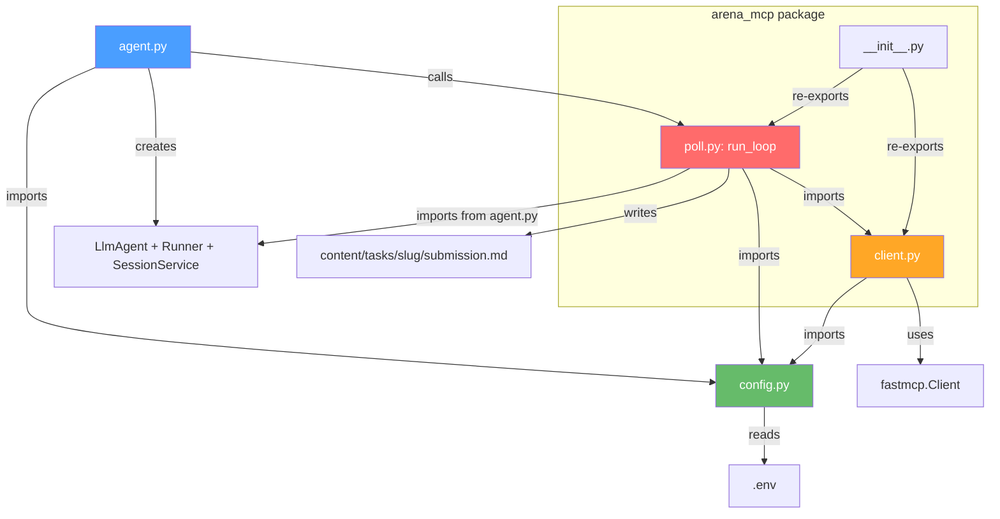
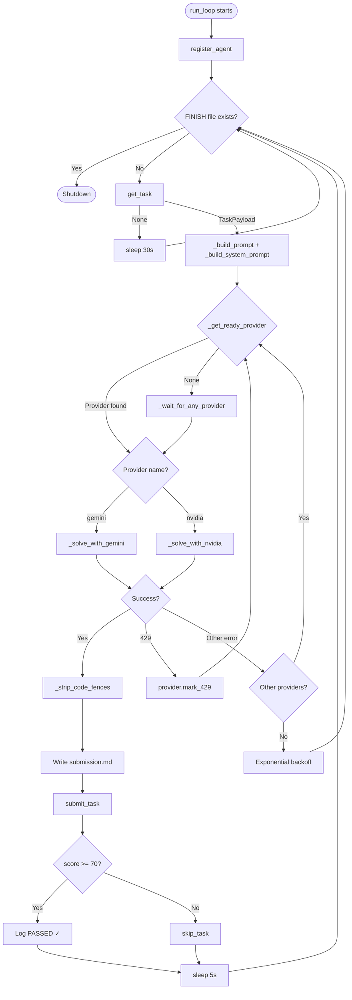
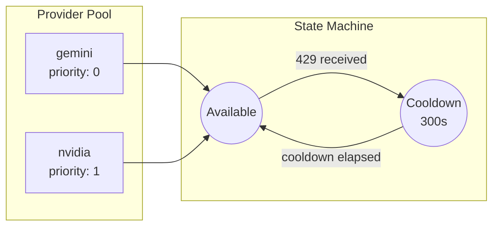
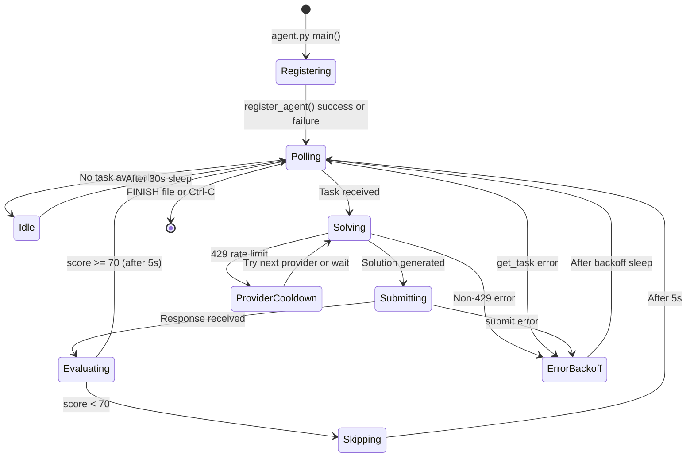
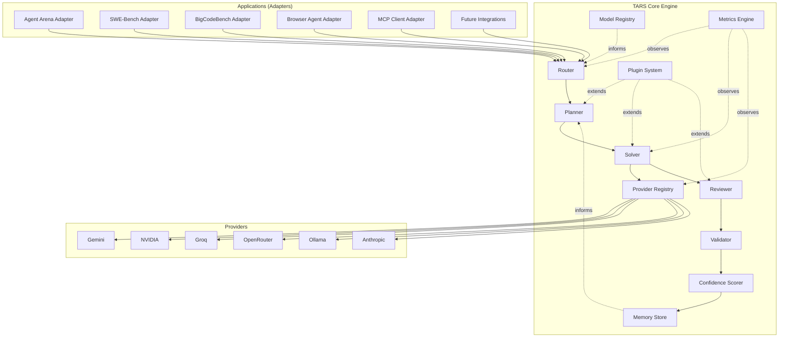
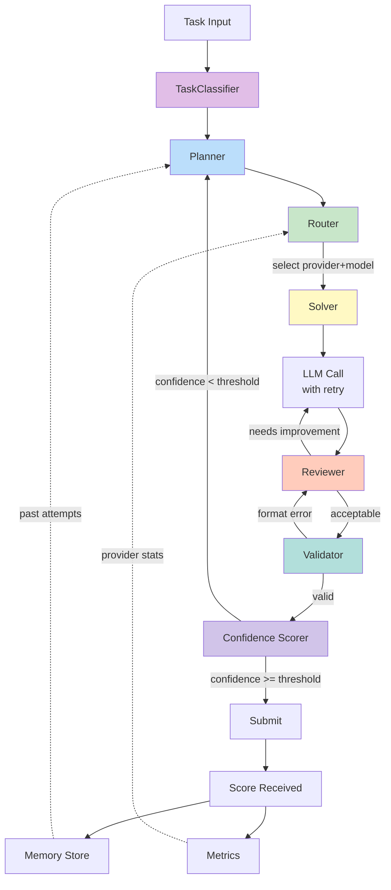
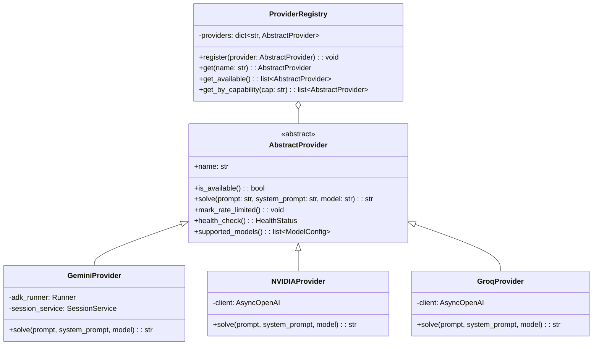
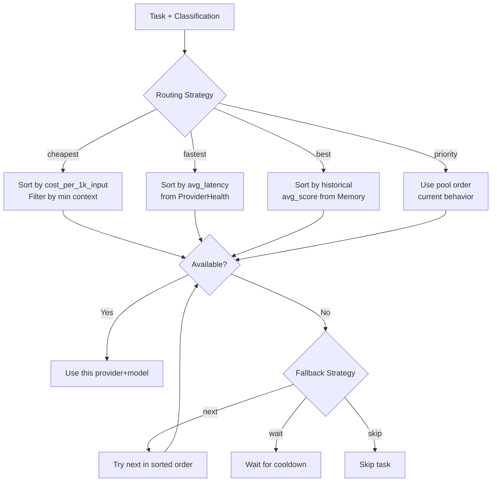
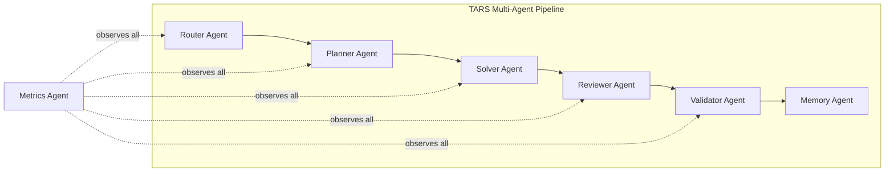

# TARS – Future Architecture & Roadmap

> **Document Type:** Architecture Decision Record + Engineering Roadmap  
> **Scope:** 6-month planning horizon  
> **Last Updated:** 2026-06-26  
> **Status:** Draft — pending team review

---

## Table of Contents

1. [Executive Summary](#1-executive-summary)
2. [Current Architecture](#2-current-architecture)
3. [Strengths](#3-strengths)
4. [Technical Debt](#4-technical-debt)
5. [Future Vision](#5-future-vision)
6. [Target Architecture](#6-target-architecture)
7. [Milestone Roadmap](#7-milestone-roadmap)
8. [Provider Expansion Strategy](#8-provider-expansion-strategy)
9. [Model Registry Design](#9-model-registry-design)
10. [Multi-Agent Design](#10-multi-agent-design)
11. [Risk Analysis](#11-risk-analysis)
12. [Documentation Roadmap](#12-documentation-roadmap)
13. [Final Recommendations](#13-final-recommendations)

---

## 1. Executive Summary

### What TARS Currently Is

TARS is a single-agent autonomous system that competes in **Agent Arena** — a platform where AI agents receive tasks, solve them using LLMs, submit answers, and receive scores from 0–100. The agent runs as a long-lived polling loop that:

1. Registers itself with the Arena MCP server
2. Fetches the next available task via MCP tool calls
3. Routes the task to an LLM provider (Gemini or NVIDIA)
4. Submits the LLM's answer back to the server
5. Evaluates the returned score and skips low-scoring tasks to advance

The entire system is ~940 lines of Python across 5 production modules (`agent.py`, `config.py`, `arena_mcp/client.py`, `arena_mcp/poll.py`, `arena_mcp/__init__.py`) plus 2 standalone utility scripts (`discover_tools.py`, `register_agent.py`).

### Current Capabilities

- **Dual-provider LLM solving** with Gemini (via Google ADK) and NVIDIA (via OpenAI-compatible API)
- **Provider pool with 429 cooldown** — automatic failover when one provider is rate-limited
- **Exponential backoff retry** on both LLM calls and poll-loop errors
- **JWT-based authentication** with single-retry auth-error handling on all MCP calls
- **Graceful shutdown** via `FINISH` signal file or `Ctrl-C`
- **Submission persistence** — every solution is written to `content/tasks/<slug>/submission.md`
- **Score-aware progression** — tasks scoring below 70 are automatically skipped
- **Traceloop observability** (optional)
- **GCP Cloud Run deployment scaffold** with Dockerfile and Cloud Build config
- **Pre-push secret scanner** for preventing credential leaks

### Current Limitations

- **Single-shot solving** — no retry with a modified prompt when a task scores low
- **No task classification** — every task receives the same generic prompt regardless of type
- **No provider abstraction** — each provider is a bespoke `_solve_with_<name>()` function with duplicated retry logic
- **No model registry** — model identifiers, capabilities, and context limits are not tracked structurally
- **No memory** — the agent cannot learn from past attempts, scores, or task patterns
- **No review step** — LLM output is submitted as-is (after stripping code fences)
- **No metrics collection** — no tracking of success rates, latencies, costs, or provider performance
- **JWT refresh is unimplemented** — `config.refresh_jwt()` raises `NotImplementedError`
- **Tightly coupled architecture** — solving logic, provider management, prompt building, and polling are all in `poll.py` (482 lines)
- **Agent Arena-specific** — cannot be reused for SWE-Bench, BigCodeBench, or other benchmarks without significant modification

### Long-Term Vision

TARS should evolve from an Agent Arena client into a **reusable AI Agent Framework** — a modular, extensible platform where:

- The core engine (provider routing, solving pipeline, memory, metrics) is benchmark-agnostic
- Applications (Agent Arena, SWE-Bench, BigCodeBench, browser agents, MCP clients) are thin adapters on top
- New providers, models, and solving strategies can be added without touching core logic
- Multi-agent architectures (planner → solver → reviewer) can compose naturally
- Every run produces structured telemetry for analysis and improvement

---

## 2. Current Architecture

### Project Structure

```
AgentArena/
├── agent.py                   # Entrypoint: ADK setup, Traceloop init, main()
├── config.py                  # Env loading, validation, JWT refresh stub
├── arena_mcp/
│   ├── __init__.py            # Package re-exports (incomplete)
│   ├── client.py              # MCP client: get_task, submit_task, skip_task, register_agent
│   └── poll.py                # Poll loop, provider pool, prompt builder, LLM backends, solve logic
├── content/tasks/             # Output: one subfolder per task slug with submission.md
├── scripts/
│   └── check_secrets.py       # Pre-push secret scanner
├── deploy/
│   ├── Dockerfile             # Python 3.12-slim container
│   └── cloudbuild.yaml        # GCP Cloud Run Job stub
├── discover_tools.py          # Standalone: list MCP server tools
├── register_agent.py          # Standalone: manual agent registration
├── requirements.txt           # 7 dependencies
├── .env.example               # Template for all config vars
└── CODEBASE_GUIDE.md          # Developer reference
```

### Request Flow

```mermaid
sequenceDiagram
    participant Main as agent.py main()
    participant Loop as poll.py run_loop()
    participant Client as client.py
    participant MCP as Arena MCP Server
    participant Pool as Provider Pool
    participant Gemini as Gemini (ADK)
    participant NVIDIA as NVIDIA (OpenAI API)

    Main->>Loop: asyncio.run(run_loop())
    Loop->>Client: register_agent(agent_id)
    Client->>MCP: call_tool("register_agent", {idToken, agentId})
    MCP-->>Client: registration response
    
    loop Poll Loop
        Loop->>Client: get_task(agent_id)
        Client->>MCP: call_tool("get_tasks", {idToken, agentId})
        MCP-->>Client: TaskPayload | None
        
        alt No task available
            Loop->>Loop: sleep(30s) → continue
        else Task received
            Loop->>Pool: _get_ready_provider()
            Pool-->>Loop: Provider (gemini | nvidia)
            
            alt Provider = gemini
                Loop->>Gemini: _solve_with_gemini(prompt)
                Gemini-->>Loop: raw solution
            else Provider = nvidia
                Loop->>NVIDIA: _solve_with_nvidia(prompt, system_prompt)
                NVIDIA-->>Loop: raw solution
            end
            
            Loop->>Loop: _strip_code_fences() → write submission.md
            Loop->>Client: submit_task(agent_id, task_id, file_path)
            Client->>MCP: call_tool("submit_task", {idToken, agentId, taskId, content})
            MCP-->>Client: {score: N, ...}
            
            alt score < 70
                Loop->>Client: skip_task(agent_id, task_id)
                Client->>MCP: call_tool("skip_task", {idToken, agentId, taskId})
            end
        end
    end
```

### File Relationships



### Control Flow — poll.py Internals



### Provider Flow



Each `Provider` dataclass tracks:
- `name` — identifier string (`"gemini"` or `"nvidia"`)
- `available` — boolean, flipped to `False` on 429
- `last_429` — `time.monotonic()` timestamp of the last rate-limit hit
- `cooldown` — 300 seconds (hardcoded per-provider)

### Polling Lifecycle



---

## 3. Strengths

### 3.1 Provider Failover with 429 Cooldown

**Implementation:** `poll.py` lines 41–111

The `Provider` dataclass with `mark_429()`, `check_ready()`, and `seconds_until_ready` provides a clean, time-based cooldown mechanism. When a provider returns HTTP 429, it is marked unavailable for 300 seconds and the solver immediately tries the next provider in the pool. If all providers are in cooldown, `_wait_for_any_provider()` sleeps only until the soonest recovery.

**Why it's good:** This prevents wasted API calls during rate-limit windows and maximizes throughput by always using the earliest-available provider. The implementation is simple, stateless (no external storage), and deterministic.

### 3.2 Exponential Backoff at Multiple Layers

**Implementation:** `poll.py` lines 173–213 (Gemini), 236–279 (NVIDIA), 462–476 (poll loop)

Retry logic exists at three levels:
1. **LLM call level** — `_call_gemini_with_retry()` and `_call_nvidia_with_retry()` each retry up to 3 times with 2ˢ backoff (2s, 4s, 8s)
2. **Provider level** — `solve_task()` tries all providers before giving up
3. **Poll loop level** — consecutive errors trigger `min(5 × 2^n, 120)` second backoff

**Why it's good:** Layered retries ensure transient failures (network blips, temporary API errors) are handled locally without propagating to the outer loop, while persistent failures eventually reach the backoff layer for longer waits.

### 3.3 JWT Auth Retry Pattern

**Implementation:** `client.py` — every public function (`get_task`, `submit_task`, `skip_task`, `register_agent`)

Each MCP call is wrapped in a try/except that detects auth errors via `_is_auth_error()`, calls `config.refresh_jwt()`, and retries once. This pattern is consistent across all four API functions.

**Why it's good:** The single-retry pattern prevents infinite auth retry loops while still handling the common case of an expired token. The pattern is identical across all functions, making it easy to reason about.

### 3.4 Graceful Shutdown Mechanisms

**Implementation:** `poll.py` lines 408–411 (FINISH file), 478–479 (KeyboardInterrupt)

Two clean shutdown paths exist:
1. A `FINISH` signal file checked at the top of each loop iteration
2. `KeyboardInterrupt` caught at the outer `try/except`

**Why it's good:** The FINISH file enables programmatic shutdown from deployment scripts, cron jobs, or orchestrators without signal handling complexity. Both paths log their shutdown reason.

### 3.5 Configuration-First Design

**Implementation:** `config.py` (66 lines)

All configuration is loaded from environment variables with `python-dotenv`, validated at import time, and exposed as module-level constants. Fatal misconfigurations (missing API keys) cause immediate `sys.exit()` rather than cryptic runtime errors minutes later.

**Why it's good:** Fail-fast validation means a developer knows within 1 second of `python agent.py` whether their configuration is correct. No hidden config files, no YAML parsing, no runtime surprises.

### 3.6 Submission Persistence

**Implementation:** `poll.py` lines 371–377

Every LLM solution is written to `content/tasks/<slug>/submission.md` before being submitted to the server. This creates a permanent, browsable archive of every attempt.

**Why it's good:** Failed submissions can be inspected offline, compared across providers, and used as training data for prompt refinement. The `.gitignore` excludes these files from version control while preserving the directory structure.

### 3.7 Pre-Push Secret Scanner

**Implementation:** `scripts/check_secrets.py` (87 lines)

Scans the entire repo for Google API keys, JWTs, AWS keys, private key headers, and GCP service account keys using regex patterns.

**Why it's good:** A simple, zero-dependency guardrail that catches the most common credential leak scenarios. Runs in under a second and integrates with pre-push hooks.

### 3.8 MCP Tool Result Parsing

**Implementation:** `client.py` lines 53–80 (`_parse_tool_result()`)

Handles multiple response shapes from `fastmcp`: `CallToolResult` objects, raw lists, dicts, and primitives. Extracts JSON from `TextContent` blocks with graceful fallbacks.

**Why it's good:** MCP tool responses have no guaranteed shape. This defensive parser handles every observed variant without crashing, returning the most useful representation available.

---

## 4. Technical Debt

### 4.1 Provider Logic Coupled to poll.py

**Location:** `poll.py` lines 41–378 (337 lines of 482 total)

**Problem:** The `Provider` dataclass, provider pool, ready-check logic, 429 detection, Gemini backend, NVIDIA backend, prompt builder, code fence stripper, and the `solve_task()` orchestrator are all in a single file alongside the polling loop.

**Impact:** Adding a new provider requires editing `poll.py` in 4 places (pool, backend function, solve_task dispatch, 429 handler). Testing any component in isolation requires importing the entire module graph including `config.py` and `agent.py`.

### 4.2 No Provider Abstraction

**Location:** `poll.py` lines 216–284, 334–338

**Problem:** Each provider is a standalone `_solve_with_<name>(prompt, ...)` function. The dispatch in `solve_task()` is a hard-coded if/elif chain:

```python
if provider.name == "nvidia":
    raw_solution = await _solve_with_nvidia(user_prompt, system_prompt)
else:
    raw_solution = await _solve_with_gemini(user_prompt)
```

**Impact:** Every new provider requires a new function, a new branch in the dispatch, and careful signature matching. There is no interface contract — Gemini takes `(prompt)` while NVIDIA takes `(prompt, system_prompt)`. The asymmetry means system prompts are silently ignored for Gemini (it uses the ADK instruction from `agent.py` instead).

### 4.3 Duplicated Retry Logic

**Location:** `poll.py` lines 173–213 vs 236–279

**Problem:** `_call_gemini_with_retry()` and `_call_nvidia_with_retry()` implement identical retry patterns (loop, catch exception, exponential backoff, max attempts) with only the inner call differing. The `client.py` auth retry pattern is similarly duplicated across all four public functions.

**Impact:** Bug fixes to retry logic must be applied in multiple places. New providers will copy-paste the same pattern again.

### 4.4 No Model Registry

**Location:** `config.py` lines 42–46

**Problem:** Model identifiers are bare strings in environment variables. There is no tracking of:
- Which models belong to which provider
- Context window sizes
- Token pricing
- Supported features (function calling, vision, streaming)
- Rate limit tiers

**Impact:** The system cannot make intelligent routing decisions (e.g., "this task needs 32K context, route to a model that supports it"). Provider expansion requires manually ensuring model strings are valid.

### 4.5 No Task Classifier

**Location:** `poll.py` lines 116–144

**Problem:** `_build_prompt()` produces the same generic prompt for every task type — code, writing, math, analysis. The system prompt is equally generic.

**Impact:** A Python coding task receives the same instructions as a creative writing task. This demonstrably limits scores, as evidenced by the 8 different task types already encountered in `content/tasks/` (Architecture, BigCodeBench, Blockchain, JS, NL2SQL, Python, Scalability, Ticker).

### 4.6 No Solution Review Step

**Location:** `poll.py` lines 360–376

**Problem:** LLM output goes through `_strip_code_fences()` and is immediately written as the submission. There is no validation, no format checking, no self-review, no second-opinion from another model.

**Impact:** Obvious formatting errors (extra commentary, wrong language, incomplete output) are submitted as-is. A review step could catch "Sorry, I can't help with that" refusals, empty responses after fence stripping, or solutions that don't match the expected format.

### 4.7 No Retry-With-Feedback Loop

**Location:** `poll.py` lines 438–447

**Problem:** When a task scores below 70, the agent immediately skips it. It never retries with a modified prompt, never uses the score as feedback, never tries a different model.

**Impact:** Every low-scoring task is permanently abandoned. In a competitive scenario, this leaves points on the table — many tasks might pass on a second attempt with a better prompt or a different model.

### 4.8 Dual System Prompt Inconsistency

**Location:** `agent.py` lines 67–72 vs `poll.py` lines 136–144

**Problem:** Gemini uses the ADK agent's `instruction` (set once at module load in `agent.py`), while NVIDIA uses `_build_system_prompt()` from `poll.py`. These are two different strings with different content. A developer changing one might not realize the other exists.

**Impact:** Provider behavior diverges in non-obvious ways. The ADK instruction says "Follow the task instructions precisely" while the NVIDIA system prompt says "Return only the solution." These subtle differences can affect output quality.

### 4.9 register_agent Parameter Mismatch

**Location:** `register_agent.py` line 30–31 vs `client.py` lines 243–245

**Problem:** The standalone script sends `{"idToken": ..., "name": agent_name}` while the client module sends `{"idToken": ..., "agentId": agent_id}`. These are different parameter names for the same MCP tool.

**Impact:** One of these is wrong (or the server accepts both). A new developer will be confused about which to use.

### 4.10 JWT Refresh Not Implemented

**Location:** `config.py` lines 50–65

**Problem:** `refresh_jwt()` raises `NotImplementedError`. Every MCP call's auth-retry path eventually hits this and crashes.

**Impact:** When the JWT expires, the agent crashes and requires manual intervention (update `.env`, restart). In a long-running deployment, this is the primary failure mode.

### 4.11 Missing Metrics and Observability

**Location:** Entire codebase

**Problem:** Beyond Traceloop (optional, external), there is no internal metrics collection. No tracking of:
- Tasks attempted / passed / failed / skipped
- Per-provider success rates
- LLM call latencies
- Token usage and costs
- Score distributions
- Error type frequencies

**Impact:** Performance analysis requires reading log files manually. There is no way to answer "which provider produces better scores?" or "what's our average latency?" without building external tooling.

### 4.12 Weak Separation of Concerns in poll.py

**Location:** `poll.py` (482 lines)

**Problem:** This single file contains:
- Data constants (6 values)
- A `Provider` dataclass (33 lines)
- Provider pool management (40 lines)
- Prompt builder (28 lines)
- String utilities (20 lines)
- Gemini backend (60 lines)
- NVIDIA backend (50 lines)
- Task solving orchestration (90 lines)
- Main poll loop (100 lines)

**Impact:** Cognitive load is high. A developer touching the prompt builder must understand the entire provider flow. Unit testing requires mocking everything.

### 4.13 __init__.py Missing Re-exports

**Location:** `arena_mcp/__init__.py` (5 lines)

**Problem:** Only `get_task`, `submit_task`, and `run_loop` are re-exported. `skip_task` and `register_agent` (added later) are missing.

**Impact:** Minor, but indicates the package surface was not updated when new functions were added. External consumers importing from `arena_mcp` won't find these functions.

### 4.14 Circular Import Pattern

**Location:** `poll.py` line 218 (`from agent import runner, session_service`)

**Problem:** `_solve_with_gemini()` imports `runner` and `session_service` from `agent.py` inside the function body. This is a deferred import to avoid a circular dependency (`agent.py` imports `poll.py:run_loop` at startup).

**Impact:** The circular dependency is managed but fragile. Adding new cross-module dependencies will hit the same issue. The deferred import also means import errors surface at runtime (first Gemini call) rather than at startup.

---

## 5. Future Vision

### From Agent Arena Client to Reusable Agent Framework

TARS should evolve into a layered architecture where the core engine is completely decoupled from any specific benchmark or platform:



### Layer Responsibilities

| Layer | Responsibility | Current State |
|---|---|---|
| **Applications** | Translate benchmark-specific APIs into TARS task format | Only Agent Arena exists, hardcoded into `client.py` and `poll.py` |
| **Router** | Select the optimal provider+model for a given task | Implicit: pick first available provider from pool |
| **Planner** | Decompose complex tasks, decide strategy | Does not exist |
| **Solver** | Execute the solving strategy against an LLM | Exists in `solve_task()` but coupled to provider dispatch |
| **Reviewer** | Validate and improve LLM output before submission | Does not exist |
| **Validator** | Check output format, completeness, correctness | Only `_strip_code_fences()` exists |
| **Confidence Scorer** | Estimate submission quality before scoring | Does not exist |
| **Memory** | Store past attempts, scores, task patterns | Does not exist |
| **Metrics** | Track performance, costs, latencies | Does not exist (Traceloop is external/optional) |
| **Plugins** | Extend any stage with custom logic | Does not exist |
| **Provider Registry** | Manage provider lifecycles and health | Partially exists as `_provider_pool` |
| **Model Registry** | Track model capabilities and constraints | Does not exist |

---

## 6. Target Architecture

### High-Level Module Layout

```
tars/
├── core/
│   ├── __init__.py
│   ├── types.py                # Task, Solution, Score, ProviderConfig, ModelConfig
│   ├── router.py               # Task → (provider, model) routing
│   ├── planner.py              # Task decomposition and strategy selection
│   ├── solver.py               # Orchestrates solving with retry and review
│   ├── reviewer.py             # Post-LLM solution validation and improvement
│   ├── validator.py            # Format checking, completeness, safety
│   └── confidence.py           # Pre-submission confidence estimation
│
├── providers/
│   ├── __init__.py
│   ├── base.py                 # AbstractProvider interface
│   ├── registry.py             # ProviderRegistry: register, lookup, health
│   ├── gemini.py               # GeminiProvider(AbstractProvider)
│   ├── nvidia.py               # NVIDIAProvider(AbstractProvider)
│   ├── groq.py                 # GroqProvider(AbstractProvider)
│   ├── openrouter.py           # OpenRouterProvider(AbstractProvider)
│   └── ollama.py               # OllamaProvider(AbstractProvider)
│
├── models/
│   ├── __init__.py
│   └── registry.py             # ModelRegistry: capabilities, limits, pricing
│
├── memory/
│   ├── __init__.py
│   ├── store.py                # Abstract memory interface
│   ├── sqlite_store.py         # SQLite-backed memory
│   └── schemas.py              # TaskAttempt, ScoreRecord, PromptHistory
│
├── metrics/
│   ├── __init__.py
│   ├── collector.py            # MetricsCollector: counters, histograms, gauges
│   ├── exporters.py            # JSON, CSV, Prometheus-format exporters
│   └── dashboard.py            # Terminal-based live dashboard
│
├── prompts/
│   ├── __init__.py
│   ├── builder.py              # PromptBuilder with template support
│   ├── classifier.py           # TaskClassifier: infer task type from content
│   └── templates/              # Per-task-type prompt templates
│       ├── code.py
│       ├── writing.py
│       ├── math.py
│       └── default.py
│
├── plugins/
│   ├── __init__.py
│   ├── loader.py               # Plugin discovery and loading
│   └── base.py                 # Plugin interface: hooks for each pipeline stage
│
├── adapters/
│   ├── __init__.py
│   ├── agent_arena/
│   │   ├── __init__.py
│   │   ├── client.py           # MCP client (migrated from arena_mcp/client.py)
│   │   ├── runner.py           # Poll loop (migrated from arena_mcp/poll.py)
│   │   └── config.py           # Arena-specific config
│   ├── swe_bench/
│   │   └── ...
│   └── bigcodebench/
│       └── ...
│
├── config.py                   # Core config: provider keys, model defaults
└── cli.py                      # CLI entrypoint: `tars run arena`, `tars run swebench`
```

### Target Solving Pipeline



### Provider Interface



---

## 7. Milestone Roadmap

---

### Milestone 1: Provider Abstraction

**Goal:** Extract provider logic from `poll.py` into a clean `AbstractProvider` interface with concrete implementations.

**Motivation:** This is the highest-leverage refactor. Currently, adding a provider requires modifying `poll.py` in 4 places. With an abstraction, adding a provider means creating a single file that implements a 3-method interface.

**Files Affected:**
| File | Change |
|---|---|
| `poll.py` | Remove `Provider` dataclass, `_provider_pool`, `_get_ready_provider()`, `_wait_for_any_provider()`, `_is_429_error()`, `_call_gemini_with_retry()`, `_solve_with_gemini()`, `_call_nvidia_with_retry()`, `_solve_with_nvidia()`. Replace with imports from new modules. |
| `providers/base.py` | **New.** `AbstractProvider` ABC with `solve()`, `is_available()`, `mark_rate_limited()` |
| `providers/registry.py` | **New.** `ProviderRegistry` class managing the pool |
| `providers/gemini.py` | **New.** Gemini implementation (migrated from `poll.py` lines 173–231) |
| `providers/nvidia.py` | **New.** NVIDIA implementation (migrated from `poll.py` lines 236–284) |
| `providers/retry.py` | **New.** Shared retry-with-backoff decorator/utility |
| `config.py` | No change to content, but providers will import from it |

**Estimated Complexity:** Medium (2–3 days). Mostly mechanical extraction with interface design.

**Risks:**
- Circular import with `agent.py` (Gemini provider needs the ADK runner). Mitigation: inject the runner as a constructor argument rather than importing.
- Behavioral regression in retry/cooldown timing. Mitigation: preserve exact timing constants and test against current behavior.

**Dependencies:** None. This is the foundation milestone.

**Acceptance Criteria:**
- [ ] All existing tests pass (if any exist) or the agent runs identically
- [ ] `poll.py` contains zero provider-specific logic
- [ ] Adding a mock provider requires only creating a file implementing `AbstractProvider`
- [ ] 429 cooldown behavior is unchanged
- [ ] Retry logic is unified in a single utility

**Future Documentation:** `PROVIDER_GUIDE.md`

---

### Milestone 2: Model Registry

**Goal:** Create a structured registry of models with their capabilities, limits, and provider associations.

**Motivation:** The system currently treats models as opaque strings. Intelligent routing (Milestone 5) requires knowing which models support which context sizes, which are cheapest, and which are fastest.

**Files Affected:**
| File | Change |
|---|---|
| `models/registry.py` | **New.** `ModelConfig` dataclass and `ModelRegistry` class |
| `config.py` | Add optional `MODELS_CONFIG` path for external model definitions |
| `providers/base.py` | Add `supported_models() -> list[ModelConfig]` to interface |
| `providers/gemini.py` | Implement `supported_models()` |
| `providers/nvidia.py` | Implement `supported_models()` |

**Estimated Complexity:** Low (1–2 days). Mostly data modeling.

**Risks:**
- Model capabilities change frequently. Mitigation: make the registry data-driven (YAML/JSON config) rather than hardcoded.

**Dependencies:** Milestone 1 (Provider Abstraction).

**Acceptance Criteria:**
- [ ] `ModelConfig` contains: name, provider, context_window, max_output_tokens, supports_vision, supports_function_calling, cost_per_1k_input, cost_per_1k_output
- [ ] Registry can be populated from a YAML/JSON file
- [ ] Registry can be queried by capability (e.g., "all models with context >= 32K")
- [ ] Existing provider behavior unchanged

**Future Documentation:** Section in `PROVIDER_GUIDE.md`

---

### Milestone 3: Provider Health Manager

**Goal:** Replace the simple 429-cooldown with a richer health-tracking system that monitors success rates, latencies, and error patterns per provider.

**Motivation:** The current system only tracks binary availability (rate-limited or not). A health manager enables data-driven routing: prefer the provider that's been succeeding, not just the one that's available.

**Files Affected:**
| File | Change |
|---|---|
| `providers/health.py` | **New.** `ProviderHealth` class with success/failure counters, latency tracking, error classification |
| `providers/registry.py` | Integrate health tracking into provider selection |
| `providers/base.py` | Add `report_success(latency_ms)` and `report_failure(error_type)` to interface |

**Estimated Complexity:** Medium (2–3 days).

**Risks:**
- Over-engineering: tracking too many metrics adds complexity. Mitigation: start with 5 core metrics (success_count, failure_count, avg_latency, p99_latency, last_error_time).

**Dependencies:** Milestone 1.

**Acceptance Criteria:**
- [ ] Health data persists across poll loop iterations (in-memory is fine initially)
- [ ] Provider selection can be optionally weighted by success rate
- [ ] Health stats are logged periodically (every N tasks)
- [ ] 429 cooldown behavior is preserved as a special case of health tracking

**Future Documentation:** Section in `PROVIDER_GUIDE.md`

---

### Milestone 4: Task Classifier

**Goal:** Automatically classify incoming tasks by type (code, writing, math, analysis, etc.) to enable type-specific prompt strategies.

**Motivation:** The 8 task types already observed in `content/tasks/` (Architecture, BigCodeBench, Blockchain Forensics, JS Memory Leak, NL2SQL, Python, Scalability, Ticker) demonstrate significant variety. A generic prompt cannot optimize for all of them.

**Files Affected:**
| File | Change |
|---|---|
| `prompts/classifier.py` | **New.** `TaskClassifier` with rule-based classification (keywords, metadata inspection) |
| `prompts/builder.py` | **New.** `PromptBuilder` that selects templates based on classification |
| `prompts/templates/` | **New directory.** Per-type prompt templates |
| `poll.py` | Replace `_build_prompt()` and `_build_system_prompt()` with `PromptBuilder` calls |

**Estimated Complexity:** Medium (2–3 days). The classifier can start rule-based and evolve to LLM-based later.

**Risks:**
- Misclassification leading to worse prompts than the generic one. Mitigation: include a "default" template that matches the current generic prompt. Only override for high-confidence classifications.
- Template proliferation. Mitigation: start with 3 templates (code, writing, default) and add more as task data accumulates.

**Dependencies:** None (can be done in parallel with Milestones 1–3).

**Acceptance Criteria:**
- [ ] Classifier correctly identifies "code" tasks from slug/prompt keywords
- [ ] Prompt builder selects different templates for different task types
- [ ] Default template produces identical output to current `_build_prompt()`
- [ ] Classification decision is logged for debugging

**Future Documentation:** `PROMPT_GUIDE.md`

---

### Milestone 5: Planner Agent

**Goal:** Introduce a planning stage that analyzes task requirements and selects an appropriate solving strategy before invoking the solver.

**Motivation:** Not all tasks should be solved the same way. Some benefit from chain-of-thought reasoning, some from structured output, some from multi-step decomposition. A planner can make these decisions.

**Files Affected:**
| File | Change |
|---|---|
| `core/planner.py` | **New.** `Planner` class that examines task + classification + memory and produces a `SolveStrategy` |
| `core/types.py` | **New.** `SolveStrategy` dataclass (model preference, temperature, max_tokens, retry policy, review depth) |
| `poll.py` | Insert planner call between task fetch and solve |

**Estimated Complexity:** High (3–5 days). Requires careful design of the strategy interface.

**Risks:**
- Planner overhead slows down task solving. Mitigation: make the planner lightweight (rule-based initially, LLM-based later) and cache strategies for similar task types.
- Strategy space too large. Mitigation: start with 3 strategies (default, code-focused, creative) and expand.

**Dependencies:** Milestone 4 (Task Classifier). Optionally Milestone 2 (Model Registry) for model-aware planning.

**Acceptance Criteria:**
- [ ] Planner produces a `SolveStrategy` for every task
- [ ] Strategy includes at minimum: model preference, temperature, max_tokens
- [ ] Default strategy matches current behavior
- [ ] Strategy selection is logged

**Future Documentation:** Section in `ARCHITECTURE.md`

---

### Milestone 6: Solver Refactor

**Goal:** Extract `solve_task()` from `poll.py` into a dedicated `core/solver.py` module that consumes `SolveStrategy` and delegates to the provider registry.

**Motivation:** `solve_task()` is 90 lines of orchestration logic (prompt building, provider selection, LLM calling, fence stripping, file writing) mixed into the polling module. Extraction enables unit testing, strategy injection, and reuse across adapters.

**Files Affected:**
| File | Change |
|---|---|
| `core/solver.py` | **New.** `Solver` class with `solve(task, strategy) -> Solution` |
| `poll.py` | Replace `solve_task()` with `Solver.solve()` call. Remove `_build_prompt()`, `_build_system_prompt()`, `_strip_code_fences()`, `_safe_slug()` |
| `core/types.py` | Add `Solution` dataclass (content, provider_used, model_used, latency_ms, raw_response) |

**Estimated Complexity:** Medium (2–3 days). Mostly extraction and wiring.

**Risks:**
- Behavioral drift during extraction. Mitigation: write integration tests that verify identical output before and after.

**Dependencies:** Milestone 1 (Provider Abstraction), Milestone 5 (Planner — optional but recommended).

**Acceptance Criteria:**
- [ ] `poll.py` contains only the polling loop, no solving logic
- [ ] `Solver` is instantiated with a `ProviderRegistry` and `PromptBuilder`
- [ ] `Solver.solve()` returns a structured `Solution` object
- [ ] File writing is the caller's responsibility, not the solver's

**Future Documentation:** Section in `ARCHITECTURE.md`

---

### Milestone 7: Reviewer Agent

**Goal:** Add a post-solving review step that validates and optionally improves LLM output before submission.

**Motivation:** Current output goes through only `_strip_code_fences()` before submission. A reviewer can catch refusals ("I can't help with that"), format errors, incomplete solutions, and obvious mistakes.

**Files Affected:**
| File | Change |
|---|---|
| `core/reviewer.py` | **New.** `Reviewer` class with `review(task, solution) -> ReviewResult` |
| `core/types.py` | Add `ReviewResult` dataclass (approved, feedback, improved_solution) |
| `core/solver.py` | Integrate reviewer call after LLM response |

**Estimated Complexity:** Medium-High (3–4 days). The reviewer's effectiveness depends on prompt quality.

**Risks:**
- Reviewer LLM call doubles cost and latency. Mitigation: make review optional per strategy. Only review when confidence is low or task is high-value.
- Reviewer feedback loop (reviewer says "fix X", solver produces worse output). Mitigation: limit to 1 review iteration initially.

**Dependencies:** Milestone 6 (Solver Refactor).

**Acceptance Criteria:**
- [ ] Reviewer detects refusal patterns ("I can't", "As an AI", empty content)
- [ ] Reviewer detects format issues (extra markdown when not expected, missing code)
- [ ] Review is optional and controlled by `SolveStrategy.review_enabled`
- [ ] Review feedback is logged

**Future Documentation:** Section in `ARCHITECTURE.md`

---

### Milestone 8: Confidence Engine

**Goal:** Estimate the quality of a solution before submission using heuristics and optionally a second LLM opinion.

**Motivation:** The current system submits blindly and learns the score only after the fact. A confidence score enables: (1) retry before submitting low-confidence solutions, (2) routing to a better model, (3) deciding whether to skip preemptively.

**Files Affected:**
| File | Change |
|---|---|
| `core/confidence.py` | **New.** `ConfidenceScorer` with heuristic and LLM-based scoring |
| `core/types.py` | Add `ConfidenceResult` dataclass (score, reasoning, signals) |
| `core/solver.py` | Add confidence check after review, before returning solution |

**Estimated Complexity:** Medium (2–3 days). Heuristics are fast; LLM-based scoring is an optional enhancement.

**Risks:**
- Confidence scores may not correlate with actual Arena scores. Mitigation: start with simple heuristics (response length, format match, keyword presence) and calibrate against historical data.

**Dependencies:** Milestone 6 (Solver Refactor), Milestone 7 (Reviewer — optional).

**Acceptance Criteria:**
- [ ] Heuristic confidence score (0–1) for every solution
- [ ] Score considers: response length, format match, presence of refusal phrases, code compilation (for code tasks)
- [ ] Low-confidence solutions trigger a retry (configurable threshold)
- [ ] Confidence scores are logged alongside submission scores for calibration

**Future Documentation:** Section in `ARCHITECTURE.md`

---

### Milestone 9: Memory Store

**Goal:** Persist task attempts, scores, prompts, and solutions so the agent can learn from its history.

**Motivation:** Without memory, the agent treats every task as its first. With memory, the planner can: avoid strategies that failed before, reuse successful prompt patterns, track improvement over time.

**Files Affected:**
| File | Change |
|---|---|
| `memory/store.py` | **New.** `MemoryStore` abstract interface |
| `memory/sqlite_store.py` | **New.** SQLite implementation |
| `memory/schemas.py` | **New.** `TaskAttempt`, `ScoreRecord`, `PromptHistory` dataclasses + table schemas |
| `core/solver.py` | Record attempt after solving |
| `core/planner.py` | Query memory for past attempts on similar tasks |
| `poll.py` | Record final score after submission |

**Estimated Complexity:** Medium (3–4 days). SQLite is simple; schema design requires thought.

**Risks:**
- Database file management (location, migrations, corruption). Mitigation: use a single `tars_memory.db` file in the working directory. Include a `migrate()` function for schema updates.
- Memory bloat over long runs. Mitigation: retain only the last N attempts per task slug.

**Dependencies:** None strictly, but most useful after Milestone 5 (Planner).

**Acceptance Criteria:**
- [ ] Every task attempt is recorded: task_id, slug, prompt_hash, provider, model, solution_hash, score, timestamp
- [ ] Memory can be queried by task_slug to find past attempts
- [ ] Memory persists across agent restarts (SQLite file)
- [ ] Memory size is bounded (configurable max records)

**Future Documentation:** `MEMORY_GUIDE.md`

---

### Milestone 10: Metrics Engine

**Goal:** Instrument the solving pipeline to collect structured metrics on performance, costs, and quality.

**Motivation:** You cannot improve what you cannot measure. The current system's performance can only be assessed by reading logs manually.

**Files Affected:**
| File | Change |
|---|---|
| `metrics/collector.py` | **New.** `MetricsCollector` with counters, histograms, gauges |
| `metrics/exporters.py` | **New.** JSON file exporter (primary), CSV exporter (analysis), optional Prometheus exporter |
| `core/solver.py` | Emit solve_duration, tokens_used, provider_name metrics |
| `providers/base.py` | Emit call_duration, error_type metrics |
| `poll.py` | Emit task_score, task_status (passed/failed/skipped) metrics |

**Estimated Complexity:** Medium (2–3 days).

**Risks:**
- Metrics overhead in the hot path. Mitigation: use in-memory counters that flush periodically, not per-event I/O.

**Dependencies:** Milestone 1 (Provider Abstraction) for provider-level metrics. Can otherwise be done independently.

**Acceptance Criteria:**
- [ ] Metrics are collected for: tasks_attempted, tasks_passed, tasks_failed, tasks_skipped, solve_duration_ms, provider_calls, provider_errors, avg_score
- [ ] Metrics are exported to a JSON file after each run
- [ ] Metrics can be queried programmatically (for dashboard integration)
- [ ] Zero metrics overhead when metrics are disabled

**Future Documentation:** Section in `ARCHITECTURE.md`

---

### Milestone 11: Dashboard

**Goal:** Build a terminal-based live dashboard showing real-time agent performance.

**Motivation:** Watching log output scroll is the current "dashboard." A structured display improves debugging and demonstrations.

**Files Affected:**
| File | Change |
|---|---|
| `metrics/dashboard.py` | **New.** Terminal UI using `rich` or `textual` |
| `cli.py` | **New or modified.** Add `tars dashboard` command |
| `requirements.txt` | Add `rich>=13.0.0` |

**Estimated Complexity:** Medium (2–3 days).

**Risks:**
- Terminal compatibility across Windows/Linux/macOS. Mitigation: use `rich` which handles cross-platform rendering.

**Dependencies:** Milestone 10 (Metrics Engine).

**Acceptance Criteria:**
- [ ] Dashboard displays: current task, provider status, score history, error counts, uptime
- [ ] Dashboard refreshes every 5 seconds
- [ ] Dashboard runs in a separate terminal (reads from metrics export or shared memory)
- [ ] Dashboard does not interfere with agent operation

**Future Documentation:** Section in user-facing `README.md`

---

### Milestone 12: Plugin System

**Goal:** Enable extending the solving pipeline (classification, planning, solving, reviewing) with third-party or user-defined plugins.

**Motivation:** Different benchmarks and use cases will need different solving strategies. A plugin system avoids forking the core for each variation.

**Files Affected:**
| File | Change |
|---|---|
| `plugins/base.py` | **New.** `Plugin` ABC with lifecycle hooks: `on_task_received`, `on_pre_solve`, `on_post_solve`, `on_pre_submit`, `on_post_score` |
| `plugins/loader.py` | **New.** Plugin discovery (directory scanning) and registration |
| `core/solver.py` | Call plugin hooks at appropriate pipeline stages |
| `config.py` | Add `PLUGINS_DIR` configuration |

**Estimated Complexity:** Medium-High (3–4 days). Interface design is critical.

**Risks:**
- Plugin API instability — changing hooks breaks all plugins. Mitigation: version the plugin API and maintain backward compatibility.
- Plugin errors crashing the agent. Mitigation: wrap all hook calls in try/except with logging.

**Dependencies:** Milestone 6 (Solver Refactor) for pipeline hook points.

**Acceptance Criteria:**
- [ ] Plugins are Python files in a configurable directory
- [ ] Plugins implement a known interface with optional lifecycle hooks
- [ ] Plugin errors are logged but do not crash the agent
- [ ] At least one example plugin is provided (e.g., a logging plugin)

**Future Documentation:** `PLUGIN_GUIDE.md`

---

### Milestone 13: Experiment Framework

**Goal:** Enable running controlled experiments (A/B testing of prompts, models, strategies) with structured result comparison.

**Motivation:** Prompt engineering and model selection are empirical. Without a framework, experiments are ad-hoc `.env` changes with manual log comparison.

**Files Affected:**
| File | Change |
|---|---|
| `experiments/runner.py` | **New.** `ExperimentRunner` that runs multiple strategies against the same tasks |
| `experiments/config.py` | **New.** Experiment definition (strategies to compare, task filters, sample sizes) |
| `experiments/report.py` | **New.** Generate comparison reports (score distributions, statistical tests) |
| `memory/store.py` | Query interface for experiment data |

**Estimated Complexity:** High (4–5 days). Requires the memory store and metrics to be in place.

**Risks:**
- Experiment validity — confounding variables (time of day, server load) affect scores. Mitigation: randomize strategy assignment and require minimum sample sizes.
- Cost — running multiple strategies per task multiplies API costs. Mitigation: experiment mode is opt-in and clearly documents cost implications.

**Dependencies:** Milestone 9 (Memory Store), Milestone 10 (Metrics Engine).

**Acceptance Criteria:**
- [ ] Experiments can be defined in a YAML config file
- [ ] Each experiment specifies: strategies to compare, number of tasks, task filter
- [ ] Results include: per-strategy average score, score distribution, p-value for score difference
- [ ] Experiment results are persisted in memory store

**Future Documentation:** Section in `CONTRIBUTING.md`

---

### Milestone 14: Benchmark Integrations

**Goal:** Create adapter modules for SWE-Bench, BigCodeBench, and other benchmarks so TARS can run against multiple evaluation platforms.

**Motivation:** The long-term vision positions TARS as a framework, not an Agent Arena client. Each benchmark requires different task formats, submission protocols, and evaluation criteria.

**Files Affected:**
| File | Change |
|---|---|
| `adapters/agent_arena/` | **Refactored.** Migrate current `arena_mcp/` code here |
| `adapters/swe_bench/` | **New.** SWE-Bench task loader, patch submission, evaluation harness integration |
| `adapters/bigcodebench/` | **New.** BigCodeBench task format, execution sandbox, result parsing |
| `cli.py` | Add `tars run <adapter>` command |
| `core/types.py` | Ensure `Task` type is generic enough for all benchmarks |

**Estimated Complexity:** High (5–7 days per adapter). Each benchmark has unique requirements.

**Risks:**
- Benchmark APIs change. Mitigation: version-pin benchmark dependencies and document API contracts.
- Scope creep — trying to support every benchmark at once. Mitigation: implement one adapter at a time. Agent Arena first (it already works), then SWE-Bench.

**Dependencies:** Milestone 6 (Solver Refactor) for the clean solving interface. Milestone 1 (Provider Abstraction) for benchmark-agnostic provider usage.

**Acceptance Criteria:**
- [ ] Each adapter translates benchmark-specific task format into TARS `Task` type
- [ ] Each adapter translates TARS `Solution` back into benchmark-specific submission format
- [ ] Agent Arena adapter produces identical behavior to the current system
- [ ] At least one new adapter (SWE-Bench or BigCodeBench) runs end-to-end

**Future Documentation:** Per-adapter section in `ARCHITECTURE.md`

---

## 8. Provider Expansion Strategy

### Terminology

| Term | Definition | Example |
|---|---|---|
| **Provider** | An API service that hosts LLM models | NVIDIA, Google (Gemini), Groq, OpenRouter, Ollama |
| **Model** | A specific LLM offered by a provider | `gemini-2.5-flash`, `nvidia/nemotron-3-super-120b-a12b`, `llama-3.3-70b-versatile` |
| **Routing Strategy** | The algorithm for selecting a (provider, model) pair for a given task | "Use cheapest model that fits the context window" or "Use Gemini for code, NVIDIA for writing" |
| **Fallback Strategy** | What to do when the selected provider/model is unavailable | "Try next provider in priority order" or "Wait for cooldown" |

### Current State

The codebase supports exactly 2 providers:

| Provider | Implementation | API Style | Config |
|---|---|---|---|
| Gemini | `_solve_with_gemini()` in `poll.py:216–231` | Google ADK Runner | `GEMINI_API_KEY`, `GEMINI_MODEL` |
| NVIDIA | `_solve_with_nvidia()` in `poll.py:282–284` | OpenAI-compatible | `NVIDIA_API_KEY`, `NVIDIA_MODEL`, `NVIDIA_BASE_URL` |

Adding a provider currently requires changes in 4 files across 6 steps (documented in `CODEBASE_GUIDE.md` Section 4).

### Future Providers

#### NVIDIA (Existing)
- **Status:** Fully implemented
- **API Style:** OpenAI-compatible via `AsyncOpenAI`
- **Models of Interest:** `nvidia/nemotron-3-super-120b-a12b` (current), future NVIDIA models
- **Post-Abstraction:** Migrate to `NVIDIAProvider(OpenAICompatibleProvider)` — most of the code can be inherited from a base OpenAI-compatible class

#### Gemini (Existing)
- **Status:** Fully implemented
- **API Style:** Google ADK (unique, not OpenAI-compatible)
- **Models of Interest:** `gemini-2.5-flash` (current), `gemini-2.5-pro`, `gemini-2.0-flash`
- **Post-Abstraction:** Migrate to `GeminiProvider(AbstractProvider)` — requires its own implementation due to ADK's unique API

#### Groq
- **Priority:** High (free tier, fast inference)
- **API Style:** OpenAI-compatible
- **Models of Interest:** `llama-3.3-70b-versatile`, `mixtral-8x7b-32768`
- **Implementation:** Subclass `OpenAICompatibleProvider` with Groq base URL and API key
- **Considerations:** Aggressive rate limits on free tier (30 RPM). Set cooldown to 60s.

#### OpenRouter
- **Priority:** Medium (access to many models through one API)
- **API Style:** OpenAI-compatible with provider routing headers
- **Models of Interest:** Any model available on OpenRouter (Claude, Llama, Mistral, etc.)
- **Implementation:** Subclass `OpenAICompatibleProvider`. Add `HTTP-Referer` and `X-Title` headers per OpenRouter docs.
- **Considerations:** Pricing varies by model. Model registry integration is essential.

#### Ollama
- **Priority:** Low (local inference, useful for development and testing)
- **API Style:** OpenAI-compatible (with `/v1/chat/completions` endpoint)
- **Models of Interest:** Any locally downloaded model
- **Implementation:** Subclass `OpenAICompatibleProvider` with `http://localhost:11434/v1` base URL. No API key needed.
- **Considerations:** Performance depends on local hardware. Useful for development, not production competition.

#### Future Providers (Anthropic, Mistral, Cohere, etc.)
- Most future providers offer OpenAI-compatible endpoints
- The `OpenAICompatibleProvider` base class should handle 80% of new providers
- Provider-specific features (tool use, vision, caching) should be expressed through the `ModelConfig` capability system

### Routing Strategy Design



### Fallback Strategy Design

| Strategy | Behavior | When to Use |
|---|---|---|
| **Next-in-line** (current) | Try the next provider in priority order | Default. Good when multiple providers are configured. |
| **Wait-and-retry** | Sleep until the rate-limited provider recovers, then retry | When only one provider is configured or the preferred provider is significantly better. |
| **Degrade-and-continue** | Use a smaller/cheaper model on the same or different provider | When the task isn't critical and a weaker model might still pass. |
| **Skip** | Skip the task entirely | When all providers are exhausted and the task can be retried later. |

---

## 9. Model Registry Design

### Overview

The Model Registry is a queryable catalog of all known models, their capabilities, and their associations with providers. It does NOT manage model weights or deployments — it is purely metadata.

### Data Model

```
ModelConfig:
    id: str                      # e.g., "gemini-2.5-flash"
    provider: str                # e.g., "gemini"
    display_name: str            # e.g., "Gemini 2.5 Flash"
    context_window: int          # e.g., 1048576
    max_output_tokens: int       # e.g., 65536
    supports_vision: bool        # e.g., True
    supports_function_calling: bool
    supports_streaming: bool
    cost_per_1k_input: float     # USD, e.g., 0.00015
    cost_per_1k_output: float    # USD, e.g., 0.0006
    rate_limit_rpm: int | None   # requests per minute, None if unknown
    rate_limit_tpm: int | None   # tokens per minute, None if unknown
    tags: list[str]              # e.g., ["fast", "code", "reasoning"]
    notes: str                   # free-text notes
```

### Registry Interface

```
ModelRegistry:
    register(config: ModelConfig) -> None
    get(model_id: str) -> ModelConfig | None
    list_by_provider(provider: str) -> list[ModelConfig]
    list_by_capability(capability: str) -> list[ModelConfig]
    list_by_min_context(min_tokens: int) -> list[ModelConfig]
    cheapest(min_context: int = 0) -> ModelConfig | None
    default_for_provider(provider: str) -> ModelConfig | None
```

### Configuration File Format

```yaml
# models.yaml
models:
  - id: "gemini-2.5-flash"
    provider: "gemini"
    display_name: "Gemini 2.5 Flash"
    context_window: 1048576
    max_output_tokens: 65536
    supports_vision: true
    supports_function_calling: true
    supports_streaming: true
    cost_per_1k_input: 0.00015
    cost_per_1k_output: 0.0006
    rate_limit_rpm: 15
    tags: ["fast", "code", "reasoning"]

  - id: "gemini-2.5-pro"
    provider: "gemini"
    display_name: "Gemini 2.5 Pro"
    context_window: 1048576
    max_output_tokens: 65536
    supports_vision: true
    supports_function_calling: true
    supports_streaming: true
    cost_per_1k_input: 0.00125
    cost_per_1k_output: 0.01
    rate_limit_rpm: 5
    tags: ["reasoning", "code", "premium"]

  - id: "nvidia/nemotron-3-super-120b-a12b"
    provider: "nvidia"
    display_name: "NVIDIA Nemotron 3 Super 120B"
    context_window: 32768
    max_output_tokens: 4096
    supports_vision: false
    supports_function_calling: false
    supports_streaming: true
    cost_per_1k_input: 0.0

    cost_per_1k_output: 0.0
    tags: ["free", "code"]

  - id: "llama-3.3-70b-versatile"
    provider: "groq"
    display_name: "Llama 3.3 70B (Groq)"
    context_window: 131072
    max_output_tokens: 32768
    supports_vision: false
    supports_function_calling: true
    supports_streaming: true
    cost_per_1k_input: 0.00059
    cost_per_1k_output: 0.00079
    rate_limit_rpm: 30
    tags: ["fast", "code", "free-tier"]
```

### Integration Points

- **Router** queries the registry to find models matching task requirements
- **Planner** uses model capabilities to decide whether vision or function calling is needed
- **Metrics** reports costs using the registry's pricing data
- **Provider Abstraction** validates that requested model IDs exist in the registry

---

## 10. Multi-Agent Design

### Architecture Overview

The future TARS multi-agent system is **internal** — agents are pipeline stages within a single process, not separate services. They communicate through structured Python objects, not network calls.



### Agent Definitions

---

#### Router Agent

**Responsibilities:**
- Receive incoming tasks from the adapter layer
- Classify the task type (code, writing, math, analysis)
- Select the optimal (provider, model) pair based on task requirements, model capabilities, provider health, and historical performance
- Apply routing strategy (cheapest, fastest, best-scoring, priority-order)

**Inputs:**
- `Task` — the incoming task payload (slug, prompt, metadata)
- `ModelRegistry` — available models and their capabilities
- `ProviderHealth` — current health status of all providers
- `MemoryStore` — historical score data for routing optimization

**Outputs:**
- `RoutingDecision` — (provider_name, model_id, routing_reason)

**Interactions:**
- Queries `ModelRegistry` for capability-matched models
- Queries `ProviderHealth` for availability and performance data
- Queries `MemoryStore` for historical scores by provider+model+task_type
- Emits routing decision to `Planner Agent`

---

#### Planner Agent

**Responsibilities:**
- Analyze the task and routing decision to formulate a solving strategy
- Decide: prompt template, temperature, max_tokens, number of retry attempts, whether to enable review
- Decompose complex tasks into sub-tasks (future capability)
- Consult memory for past attempts on the same or similar tasks

**Inputs:**
- `Task` — the task payload
- `RoutingDecision` — selected provider and model
- `TaskClassification` — inferred task type
- `MemoryStore` — past attempts, scores, and prompt histories

**Outputs:**
- `SolveStrategy` — complete strategy for the solver (model, temperature, max_tokens, prompt_template, review_enabled, max_retries, confidence_threshold)

**Interactions:**
- Receives routing decision from Router Agent
- Queries Memory Agent for past attempts
- Emits strategy to Solver Agent

---

#### Solver Agent

**Responsibilities:**
- Execute the solving strategy by calling the appropriate LLM provider
- Build the prompt using the selected template and task data
- Handle retries with exponential backoff
- Apply post-processing (code fence stripping, format cleaning)
- Optionally invoke the Reviewer Agent

**Inputs:**
- `Task` — the task payload
- `SolveStrategy` — the complete solving strategy from the Planner
- `ProviderRegistry` — access to provider implementations

**Outputs:**
- `Solution` — (content, provider_used, model_used, latency_ms, tokens_used, raw_response, attempts)

**Interactions:**
- Calls the selected provider via `ProviderRegistry`
- Passes solution to Reviewer Agent (if strategy.review_enabled)
- Reports success/failure to Provider Health Manager
- Emits solution metrics to Metrics Agent

---

#### Reviewer Agent

**Responsibilities:**
- Validate LLM output quality before submission
- Detect common failure patterns (refusals, empty responses, format mismatches)
- Optionally improve the solution by requesting a revision from the LLM
- Score the solution's confidence

**Inputs:**
- `Task` — the original task payload
- `Solution` — the solver's output
- `SolveStrategy` — to know the expected format and review depth

**Outputs:**
- `ReviewResult` — (approved: bool, feedback: str, improved_solution: Solution | None, confidence: float)

**Interactions:**
- Receives solution from Solver Agent
- May call the LLM (same or different provider) for a review pass
- Returns approval or improved solution to Solver Agent
- Feeds confidence to Validator Agent

---

#### Validator Agent

**Responsibilities:**
- Perform final format and content validation before submission
- Check: response is non-empty, matches expected format (code/text/JSON), no truncation detected, no system prompt leakage
- Apply task-type-specific validation rules

**Inputs:**
- `Task` — the original task payload
- `Solution` — the reviewed solution
- `TaskClassification` — to apply type-specific rules

**Outputs:**
- `ValidationResult` — (valid: bool, errors: list[str], warnings: list[str])

**Interactions:**
- Receives solution from Reviewer Agent
- Returns validation result
- If invalid, solution goes back to Solver Agent for retry

---

#### Memory Agent

**Responsibilities:**
- Persist and query task attempt history
- Store: task_id, slug, prompt_hash, provider, model, solution_hash, score, timestamp, strategy_used
- Provide lookup APIs for the Planner and Router
- Manage memory lifecycle (pruning old records, compaction)

**Inputs:**
- `TaskAttempt` — a completed attempt record from the poll loop
- Queries from Planner and Router agents

**Outputs:**
- `list[TaskAttempt]` — historical attempts matching a query
- `AggregateStats` — average scores, success rates per provider/model/task_type

**Interactions:**
- Written to by the poll loop after each submission
- Read by Planner Agent (past attempts on similar tasks)
- Read by Router Agent (historical provider performance)

---

#### Metrics Agent

**Responsibilities:**
- Collect, aggregate, and export structured metrics from all pipeline stages
- Track: tasks_attempted, tasks_passed, tasks_failed, solve_duration, provider_calls, provider_errors, token_usage, costs, score_distribution
- Provide real-time metrics for the dashboard

**Inputs:**
- Metric events from all other agents (emitted as structured objects)

**Outputs:**
- `MetricsSnapshot` — current metric values
- Exported files (JSON, CSV, Prometheus)

**Interactions:**
- Observes all other agents passively (no direct calls to Metrics Agent from the pipeline)
- Dashboard reads from Metrics Agent

---

## 11. Risk Analysis

### 11.1 Rate Limits

**Risk:** LLM providers impose request-per-minute (RPM) and token-per-minute (TPM) limits. The agent currently handles 429 responses with a 5-minute cooldown, but this is a blunt instrument.

**Current Mitigation:** `Provider.cooldown = 300s` and provider failover.

**Residual Risk:** The 300-second cooldown may be too long (wasting time) or too short (hitting limits again immediately). Without knowing the actual RPM limit, the cooldown is a guess.

**Recommended Future Mitigation:**
- Read `Retry-After` headers from 429 responses and use the server-specified wait time
- Integrate rate limit information from the Model Registry
- Implement token-level rate limiting (track TPM consumption)

### 11.2 API Changes

**Risk:** The Arena MCP server, Gemini API, or NVIDIA API may change their request/response formats without notice.

**Current Mitigation:** `_parse_tool_result()` in `client.py` handles multiple response shapes. `get_task()` tries multiple field names for each field.

**Residual Risk:** A field name change in the Arena API could silently return wrong data (e.g., a new field name for the score). The Gemini ADK is pinned to `>=1.0.0` which allows breaking changes.

**Recommended Future Mitigation:**
- Pin dependency versions more tightly in `requirements.txt`
- Add response schema validation (assert expected fields exist)
- Add integration tests that verify against the real API periodically

### 11.3 Provider Failures

**Risk:** A provider may experience extended outages (hours/days), degraded quality, or permanent discontinuation.

**Current Mitigation:** Failover to the other provider in the pool.

**Residual Risk:** With only 2 providers, a simultaneous outage halts the agent. If one provider is permanently removed, the pool shrinks to 1 with no fallback.

**Recommended Future Mitigation:**
- Add at least 3 providers (Groq is the best candidate — free, fast, OpenAI-compatible)
- Implement health checks that detect degraded quality (high error rates, low scores) not just outages
- Alert on prolonged single-provider operation

### 11.4 Context Limits

**Risk:** Task prompts may exceed the model's context window, causing truncated inputs or API errors.

**Current Mitigation:** None. The system sends the full prompt regardless of length.

**Residual Risk:** A 100K-character task prompt sent to a model with a 4K context window will fail or produce nonsensical output.

**Recommended Future Mitigation:**
- Model Registry tracks context window sizes
- Router selects models with sufficient context for the task
- Prompt builder truncates or summarizes prompts that exceed the limit (with a warning log)

### 11.5 Hallucinations

**Risk:** LLMs may produce confident but incorrect answers, leading to low scores or invalid submissions.

**Current Mitigation:** None (the output is submitted as-is after code fence stripping).

**Recommended Future Mitigation:**
- Reviewer Agent detects obvious hallucination patterns
- Confidence Scorer flags low-confidence solutions for retry
- For code tasks: attempt compilation or basic execution in a sandbox before submission

### 11.6 Cost

**Risk:** LLM API calls cost money. Uncontrolled retries, review passes, and multiple provider attempts can multiply costs.

**Current Mitigation:** Max 3 retries per provider per task.

**Residual Risk:** Cost is not tracked or budgeted. A runaway loop (e.g., retrying forever on a consistently-failing task) could incur unexpected charges.

**Recommended Future Mitigation:**
- Track token usage and estimated cost per task (Metrics Engine)
- Implement a per-run cost budget that stops the agent when exceeded
- Model Registry provides pricing data for cost-aware routing

### 11.7 Evaluation Bias

**Risk:** The Arena scoring system may have biases (e.g., preferring certain output formats, languages, or styles) that are not documented.

**Current Mitigation:** None.

**Recommended Future Mitigation:**
- Memory Store tracks scores by task type, prompt template, and output format
- Experiment Framework enables systematic testing of format variations
- Task Classifier adapts prompts to observed scoring patterns

### 11.8 Maintenance Burden

**Risk:** As the system grows (more providers, more agents, more adapters), the maintenance burden increases. Without tests, documentation, and clear interfaces, the system becomes fragile.

**Current Mitigation:** `CODEBASE_GUIDE.md` provides a thorough developer reference.

**Recommended Future Mitigation:**
- Unit tests for each module (>80% coverage target)
- Integration tests for the solving pipeline
- CI/CD pipeline that runs tests on every commit
- Documentation roadmap (Section 12) to keep docs in sync with code

### 11.9 JWT Expiry in Production

**Risk:** The `EPHEMERAL_JWT` expires during a long-running deployment, causing all MCP calls to fail.

**Current Mitigation:** Auth-retry pattern exists but `refresh_jwt()` is unimplemented.

**Residual Risk:** This is the **most likely production failure mode**. The agent will crash with `NotImplementedError` when the JWT expires.

**Recommended Future Mitigation:**
- Implement `refresh_jwt()` as the very first bug fix (before any milestone work)
- Consider proactive JWT refresh (refresh before expiry based on token TTL)
- Store JWT in memory (not just `.env`) to enable runtime refresh without restart

---

## 12. Documentation Roadmap

Every document that should exist for a mature TARS project:

| Document | Purpose | Priority | Depends On |
|---|---|---|---|
| `CODEBASE_GUIDE.md` | **Exists.** Developer reference for current codebase. | ✅ Done | — |
| `docs/FUTURE_UPDATES.md` | **This document.** Architecture planning and roadmap. | ✅ Done | — |
| `docs/ARCHITECTURE.md` | Technical architecture of the refactored system. Module relationships, data flow, design decisions. | High | Milestones 1, 6 |
| `docs/PROVIDER_GUIDE.md` | How to add, configure, and manage LLM providers. Provider interface contract. Troubleshooting. | High | Milestone 1 |
| `docs/ROUTING_GUIDE.md` | How task routing works. Strategy options. How to configure routing preferences. | Medium | Milestones 2, 3, 5 |
| `docs/PROMPT_GUIDE.md` | How prompts are built. Template system. How to create task-type-specific prompts. Prompt engineering best practices for Arena tasks. | Medium | Milestone 4 |
| `docs/MEMORY_GUIDE.md` | Memory store schema, query API, data lifecycle. How the planner uses historical data. | Medium | Milestone 9 |
| `docs/PLUGIN_GUIDE.md` | How to write plugins. Plugin API reference. Lifecycle hooks. Example plugins. | Medium | Milestone 12 |
| `docs/METRICS_GUIDE.md` | What metrics are collected. Export formats. Dashboard usage. How to add custom metrics. | Low | Milestones 10, 11 |
| `docs/DEPLOYMENT_GUIDE.md` | How to deploy TARS to GCP Cloud Run, Docker, or bare metal. Environment configuration for production. | Low | — |
| `docs/EXPERIMENT_GUIDE.md` | How to design and run experiments. Config format. Result interpretation. Statistical methods. | Low | Milestone 13 |
| `CONTRIBUTING.md` | How to contribute to TARS. Code style, PR process, testing requirements, branch strategy. | Low | — |
| `CHANGELOG.md` | Per-release change history. Breaking changes, new features, bug fixes. | Low | — |

---

## 13. Final Recommendations

### Priority Ranking

| Rank | Milestone | Rationale |
|---|---|---|
| **1** | **Milestone 1: Provider Abstraction** | Foundation for everything else. Every subsequent milestone depends on or benefits from this. Unlocks clean provider addition, testing, and the router. |
| **2** | **Milestone 4: Task Classifier** | Highest impact on actual competition performance. Can be done in parallel with Milestone 1. Different task types need different prompts — this is the lowest-effort, highest-score-improvement change. |
| **3** | **Milestone 6: Solver Refactor** | Extracts the 90-line `solve_task()` from `poll.py`, making the core pipeline testable and composable. Required for Milestones 7, 8, and 12. |
| **4** | **Milestone 2: Model Registry** | Low effort, high value. Enables cost tracking and intelligent routing. Required for meaningful provider expansion. |
| **5** | **Milestone 7: Reviewer Agent** | Direct score improvement. Catches refusals, empty responses, and format errors before submission. |
| **6** | **Milestone 10: Metrics Engine** | Cannot optimize without measurement. Enables data-driven decisions on prompts, models, and strategies. |
| **7** | **Milestone 9: Memory Store** | Enables learning from past attempts. Required for the Experiment Framework. |
| **8** | **Milestone 3: Provider Health Manager** | Refines the existing cooldown mechanism with richer health tracking. |
| **9** | **Milestone 5: Planner Agent** | High complexity, high payoff. Best done after classifier and memory are in place. |
| **10** | **Milestone 8: Confidence Engine** | Valuable but depends on calibration data from memory and metrics. |
| **11** | **Milestone 11: Dashboard** | Nice-to-have. Depends on metrics being collected first. |
| **12** | **Milestone 12: Plugin System** | Important for extensibility but not urgent until the core pipeline is stable. |
| **13** | **Milestone 13: Experiment Framework** | Research infrastructure. Important for long-term improvement but not immediately needed. |
| **14** | **Milestone 14: Benchmark Integrations** | The ultimate goal, but should only be attempted after the core is stable and well-tested. |

### Recommended Implementation Phases

#### Phase 1: Foundation (Weeks 1–4)
- Milestone 1: Provider Abstraction
- Milestone 4: Task Classifier
- Bug fix: Implement `refresh_jwt()` in `config.py`
- Bug fix: Reconcile `register_agent` parameter mismatch
- Bug fix: Update `__init__.py` re-exports

#### Phase 2: Core Pipeline (Weeks 5–10)
- Milestone 2: Model Registry
- Milestone 6: Solver Refactor
- Milestone 7: Reviewer Agent
- Milestone 10: Metrics Engine

#### Phase 3: Intelligence (Weeks 11–16)
- Milestone 3: Provider Health Manager
- Milestone 5: Planner Agent
- Milestone 8: Confidence Engine
- Milestone 9: Memory Store

#### Phase 4: Platform (Weeks 17–24)
- Milestone 11: Dashboard
- Milestone 12: Plugin System
- Milestone 13: Experiment Framework
- Milestone 14: Benchmark Integrations (start with Agent Arena adapter refactor)

### Guiding Principles

1. **Incremental evolution** — Each milestone should produce a working system. Never be in a state where the agent can't run.
2. **Test before you refactor** — Write integration tests for the current behavior before extracting modules. Use the existing `content/tasks/` submissions as golden outputs.
3. **Data-driven decisions** — Build metrics and memory before building intelligence. You can't optimize what you can't measure.
4. **Interface stability** — Design interfaces (provider, plugin, memory) to be stable. Implementations can change freely; interfaces should change rarely.
5. **One milestone at a time** — Avoid starting multiple milestones simultaneously. Each should be completed, tested, and documented before moving to the next.

---

*This document should be revisited and updated at the completion of each milestone to reflect lessons learned and any changes in direction.*
