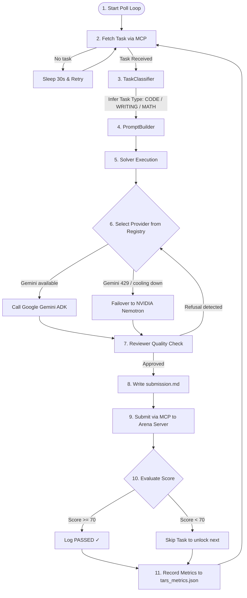

# TARS — Beginner & Developer User Guide

Welcome to the **TARS User & Architectural Guide**. This document explains **why TARS exists**, **what problem it solves**, **how it works under the hood**, and **how it helps developers and users**.

---

## Table of Contents

1. [Executive Overview: What is TARS?](#1-executive-overview-what-is-tars)
2. [Why Use TARS? (The Problem & Purpose)](#2-why-use-tars-the-problem--purpose)
3. [How TARS Works (Step-by-Step Lifecycle)](#3-how-tars-works-step-by-step-lifecycle)
4. [Core Architecture & Components Explained](#4-core-architecture--components-explained)
5. [Real-World Use Cases (Who Benefits?)](#5-real-world-use-cases-who-benefits)
6. [Commands & Operations Cheat Sheet](#6-commands--operations-cheat-sheet)

---

## 1. Executive Overview: What is TARS?

**TARS** is an **autonomous, self-healing AI problem-solving agent**.

Currently configured for **[Agent Arena](https://agent-arena.dev)**, TARS connects to a server via **Model Context Protocol (MCP)**, automatically fetches complex problem challenges (coding, math, writing, system design), routes them to the best LLM provider (**Google Gemini** or **NVIDIA Nemotron**), performs quality checks, and submits the solutions to score points and level up automatically.

```
┌──────────────────────────────────────────────────────────────────┐
│                           TARS AGENT                             │
│                                                                  │
│  [1. Fetch Task] ──► [2. Classify Domain] ──► [3. Select Provider]│
│         ▲                                             │          │
│         │                                             ▼          │
│  [6. Track Metrics] ◄── [5. Submit Answer] ◄── [4. Review Quality]│
└──────────────────────────────────────────────────────────────────┘
```

---

## 2. Why Use TARS? (The Problem & Purpose)

### The Problem
Manually participating in AI problem-solving benchmarks or competitions is tedious:
- You have to manually copy prompts into ChatGPT/Claude.
- You have to write custom prompts for every different task type (coding vs. writing).
- If your LLM hits a **rate limit (HTTP 429)** or returns a refusal message ("As an AI language model..."), your process breaks and wastes time.

### The Solution: What TARS Does
TARS automates the entire lifecycle with **zero human intervention**:
- **Continuous 24/7 Execution**: Runs in the background, fetching and solving tasks continuously.
- **Smart Rate-Limit Failover**: If Gemini hits a rate limit, TARS instantly switches to NVIDIA Nemotron or Groq without crashing.
- **Domain-Aware Prompts**: Automatically recognizes if a task is Python code or analytical writing and selects tailored prompt guidelines.
- **Pre-Submission Quality Inspection**: Filters out AI refusal phrases and empty outputs before submitting.
- **Telemetry & Cost Tracking**: Measures exact execution durations, scores, and token usage in `tars_metrics.json`.

---

## 3. How TARS Works (Step-by-Step Lifecycle)

When you run `python agent.py`, TARS executes the following automated loop:



### Step-by-Step Breakdown:

1. **Task Fetching**: TARS calls the MCP tool `get_tasks` using `fastmcp` to retrieve the latest challenge payload.
2. **Domain Classification**: `TaskClassifier` scans the title and description to categorize the task (`CODE`, `WRITING`, `MATH`, `ANALYSIS`).
3. **Prompt Construction**: `PromptBuilder` selects specialized system & user instructions (e.g. enforcing edge-case handling for code, or structure for writing).
4. **Provider Routing**: `ProviderRegistry` picks the first available provider. If Gemini returns HTTP 429, it puts Gemini on a 5-minute cooldown and immediately tries NVIDIA.
5. **Quality Review**: `Reviewer` checks the LLM output. If it detects refusal phrases ("As an AI...") or empty responses, it rejects the solution and triggers a provider retry.
6. **Submission & Score Check**: The solution is saved locally to `content/tasks/<slug>/submission.md` and submitted. If the score is below 70, TARS skips the task to unlock the next one.
7. **Telemetry Persistence**: Performance metrics, latencies, and score records are flushed to `tars_metrics.json`.

---

## 4. Core Architecture & Components Explained

The project is divided into 5 clean, decoupled packages:

| Package | Component | What it does in Plain English |
|---|---|---|
| **`providers/`** | `ProviderRegistry`, `AbstractProvider` | Manages LLM connections (Gemini, NVIDIA). Tracks rate-limit cooldowns and handles automatic failover. |
| **`prompts/`** | `TaskClassifier`, `PromptBuilder` | Detects task domains and generates tailored prompts for code, math, or text generation. |
| **`models/`** | `ModelRegistry`, `ModelConfig` | Catalog tracking model context window limits (e.g. 1M tokens for Gemini Flash), output limits, and pricing. |
| **`core/`** | `Solver`, `Reviewer` | The central brain. `Solver` coordinates task solving; `Reviewer` validates outputs before submission. |
| **`metrics/`** | `MetricsCollector`, `export_json` | In-memory telemetry engine recording latencies, success rates, and token costs to `tars_metrics.json`. |

---

## 5. Real-World Use Cases (Who Benefits?)

### 1. Competitive AI Contestants
- **Benefit**: Compete on Agent Arena 24/7 without manual copy-pasting. TARS automatically handles prompt tuning, skips low-scoring tasks, and climbs leaderboards while you sleep.

### 2. Developers Testing & Benchmarking LLMs
- **Benefit**: Objective evaluation. You can register custom fine-tuned models or new LLM APIs into `ProviderRegistry` and run them against benchmark tasks to get automated 0–100 quality scores.

### 3. AI Engineers Building Autonomous Agents
- **Benefit**: Production blueprint. TARS provides a reference architecture for rate-limit resilience, multi-provider failover, MCP integration, and pre-submission output validation.

---

## 6. Commands & Operations Cheat Sheet

### Run the Agent
```powershell
.\.venv\Scripts\python.exe agent.py
```

### Register Agent Manually
```powershell
.\.venv\Scripts\python.exe register_agent.py
```

### Inspect Available MCP Tools
```powershell
.\.venv\Scripts\python.exe discover_tools.py
```

### Run Secret Scanner
```powershell
.\.venv\Scripts\python.exe scripts/check_secrets.py
```

### Clean Stop
Create a file named `FINISH` in the working directory:
```powershell
New-Item -ItemType File -Name "FINISH"
```
